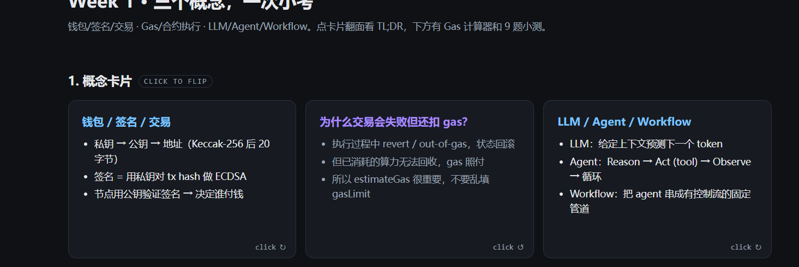
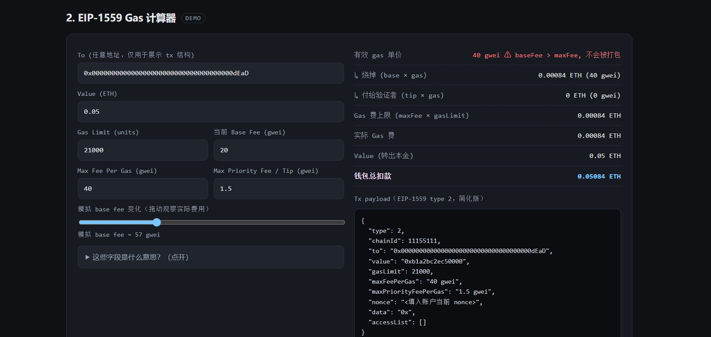
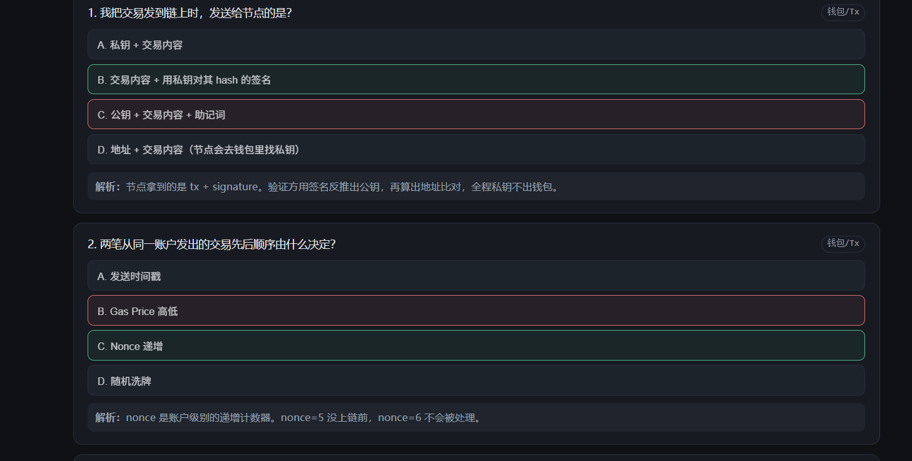

# 第一周学习任务 · 提交

## 提交物链接

| 类型 | 链接 |
| --- | --- |
| Demo 在线试玩 | https://raw.githack.com/Dongxibie/ai-web3-study-track/main/demos/week1-interactive/index.html |
| GitHub 仓库 | https://github.com/Dongxibie/ai-web3-study-track |
| Demo 源码目录 | https://github.com/Dongxibie/ai-web3-study-track/tree/main/demos/week1-interactive |
| 多工具对比模板 | https://github.com/Dongxibie/ai-web3-study-track/blob/main/notes/multi-tool-comparison.md |
| 截图 | 见下方 [§ 截图展示](#截图展示) 一节（位于 `./screenshots/`） |

---

## 1. 它解决什么学习问题

Week 1 的三个核心概念分散在不同资料里，初学者容易卡在三个点：

- 知道"私钥签名"四个字，但说不清**节点为什么不需要私钥**；
- 听过 EIP-1559，但说不清 base fee / tip / maxFee 的关系，更说不清**base fee 突涨时实际单价怎么算**；
- 能背"LLM 预测下一个 token"，但分不清 **Agent vs Workflow** 各自用在哪。

这个 demo 把三个主题压缩成 **可翻转概念卡（结论密度高）+ 可拖动的 Gas 计算器（公式变成肌肉记忆）+ 9 题 quiz（自检）**，5–8 分钟完成一轮自学闭环。零安装、零依赖、不连接钱包、零安全风险。

## 2. 用户如何与它交互

打开页面后从上到下三段：

1. **点卡片** → 翻面看延伸问题与答案。
2. **拖 Gas 计算器**：调整 `gasLimit / maxFee / tip` 数值；拖最下方"模拟 base fee"滑块，观察"有效单价 / 销毁 / 给验证者 / 钱包总扣款"实时变化；base fee 突破 maxFee 时出现红色 ⚠ "不会被打包"。
3. **答 quiz**：9 道单选，即时显示对错与解析，底部累计 `已答 X/9 · 答对 Y`。

## 3. 输入示例和输出示例

**Gas 计算器 · 输入**：

```
to:             0x000000000000000000000000000000000000dEaD
value:          0.05 ETH
gasLimit:       21000
当前 baseFee:   20 gwei
maxFeePerGas:   40 gwei
maxPriorityFee: 1.5 gwei
模拟 baseFee 滑块: 拖到 60 gwei
```

**Gas 计算器 · 输出**：

```
有效 gas 单价:        40 gwei  ⚠ 被 maxFee 截断，tip 实际 = 0 gwei
↳ 烧掉 (base × gas):  0.00084 ETH  (40 gwei)
↳ 付给验证者 (tip):   0 ETH        (0 gwei)
Gas 费上限:           0.00084 ETH
实际 Gas 费:          0.00084 ETH
Value (转出本金):     0.05 ETH
钱包总扣款:           0.05084 ETH

Tx payload (EIP-1559 type 2, 简化版):
{
  "type": 2,
  "chainId": 11155111,
  "to": "0x000...dEaD",
  "value": "0xb1a2bc2ec50000",
  "gasLimit": 21000,
  "maxFeePerGas": "40 gwei",
  "maxPriorityFeePerGas": "1.5 gwei",
  "nonce": "<填入账户当前 nonce>",
  "data": "0x",
  "accessList": []
}
```

教学要点：滑块从 20 拖到 60 时，**tip 被 maxFee 上限挤压成 0**——这正是 base fee 突涨时"验证者拿不到小费、你的交易也未必上链"的可视化。

**Quiz · 输入 / 输出**：

```
Q5: 一笔 EIP-1559 交易的有效 gas 单价是？
   A. maxFeePerGas
   B. baseFee + maxPriorityFee 总和
   C. min(maxFeePerGas, baseFee + tip)   ← 用户点这个
   D. max(maxFeePerGas, baseFee)

输出:
   选项 C 高亮绿色边框
   下方展开解析:
   "min(maxFee, baseFee + tip)。当 baseFee 突涨超过 maxFee，
    交易暂不被打包，等 baseFee 回落。"
   底部计分: 已答 5/9 · 答对 5
```

## 4. 哪部分由 AI 生成，哪部分人工修改 / 验证

**AI（Claude Code · Opus 4.7）生成**（约 90%）：

- 完整的 HTML 骨架、CSS 暗色主题、卡片翻面动画、quiz 渲染与判分 JS
- Gas 计算器的初版公式实现、初版 9 题 quiz 与解析文本
- 各 README 的初稿、多工具对比模板的初稿

**人工修改 / 验证**：

- **公式复核**：对照 EIP-1559 规范验证 `effective = min(maxFee, baseFee+tip)`、`burn = min(eff, baseFee)`、`tipActual = eff - burn`；手工拖滑块测了三种边界（baseFee < maxFee、baseFee + tip > maxFee、baseFee > maxFee）。
- **数值校准**：把 agent 给的激进默认（baseFee 100 / tip 2 / maxFee 150 gwei）改成真实主网常见区间（20 / 1.5 / 40 gwei）。
- **Quiz 修订**：第 3 题"最危险操作"选项里 testnet 一条语义有歧义，重写后让"截图存助记词"作为正确答案的对比更尖锐。
- **文案重写**：三张卡片背面的延伸答案重写了 1–2 句（agent 原文偏教科书）。
- **诚实自评**：demo README 的"不可靠点"那节是手写的——包括 `gasUsed = gasLimit` 简化、blob fee 缺失、`ecrecover` 措辞模糊。
- **目录决策**：避开仓库里已存在的三个空占位 `demos/{ai-agent,web3,workflow}-demo`，新建独立 `demos/week1-interactive/` 而不是覆盖。

## 5. 限制与下一步改进

**当前限制（教学场景能用，生产场景不能）**：

- Gas 计算器假设 `gasUsed === gasLimit`，对**合约调用**（实际 gasUsed < gasLimit、且有 refund）不准确。
- 忽略 access list (EIP-2930) gas 折扣、blob fee (EIP-4844)、L2 sequencer fee —— 仅适用 L1 主网普通转账心智模型。
- 没有真实链上数据接入，base fee 是手填 / 拖滑块的。
- "私钥不需要发出去"卡片用了"v 让验证方反推公钥"的口语描述，严谨表述应当指向 `ecrecover` 与 recovery id。
- 多工具对比模板里 Codex / Hermes 列尚未填，需要本人去跑同一份 prompt 后回填。

**下一步**：

1. 接 `viem.estimateFeesPerGas` 拉真实主网 base fee，去掉手填。
2. 加 Legacy (type 0) vs EIP-1559 (type 2) 的费用对比模式。
3. Quiz 用 localStorage 记错题本，二次进入优先复习答错过的题。
4. 卡片做中 / 英双语切换。
5. 启用 GitHub Pages 替代 raw.githack 作为稳定公开链接。
6. 加一个 WebCrypto 签名 mini-demo（仅临时密钥对，**绝不接 MetaMask**），让用户亲手感受"签名 ≠ 暴露私钥"。
7. 跑完 Codex / Hermes，把多工具对比表填满并写结论段。

---

## 截图展示

> 截图位于 `./screenshots/`，三张分别对应 demo 的三个交互模块。

### 1. 概念卡片 · cards



展示三张可翻转卡片：左侧「钱包 / 签名 / 交易」正面、右侧「LLM / Agent / Workflow」正面，中间一张已翻面，呈现「为什么交易会失败但还扣 gas?」的延伸答案——验证 click-to-flip 交互正常工作。

### 2. Gas 计算器 · gas-calculator



展示把"模拟 base fee"滑块拖到 **57 gwei**（已超过 maxFee = 40）时，"有效 gas 单价"区域显示为红色并附带 ⚠ "baseFee > maxFee, 不会被打包" 提示；同时右侧 tx payload 实时同步当前参数。这是教学场景里最重要的一个边界——比起 tip 被截断（橙色），baseFee 直接超出 maxFee 的红色态更能让人理解"为什么我的交易没上链"。

### 3. Quiz 自检 · quiz



展示 quiz 答错后的即时反馈：用户选中的错误选项标红边框，正确选项自动高亮绿色边框，下方"解析"区块自动展开补充背景知识——验证判分与解释机制正常工作。

---

## 安全声明

本提交不含 API Key、token、私钥、助记词、`.env` 文件或其他任何敏感信息。Demo 为纯前端，不连接钱包、不签名、不广播任何交易；`to` 字段仅用于展示 tx 结构。
